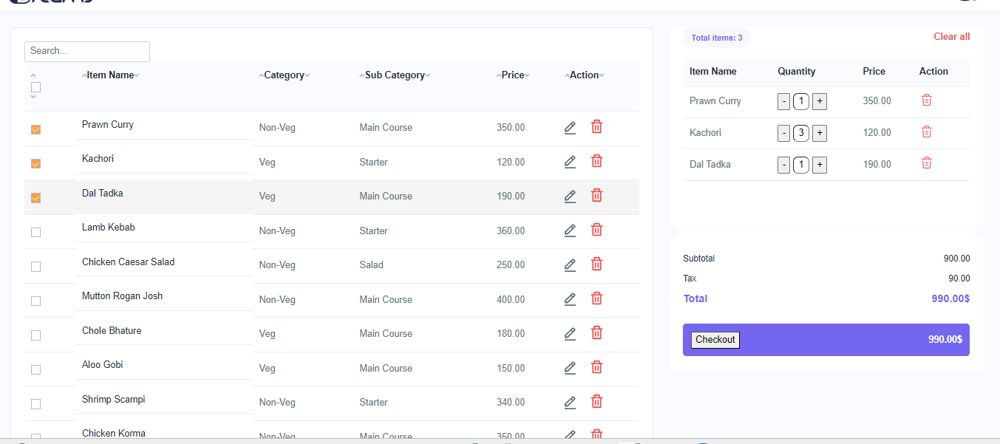
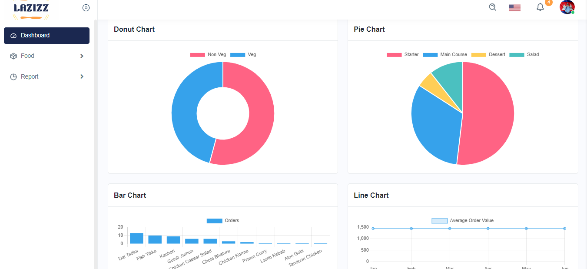
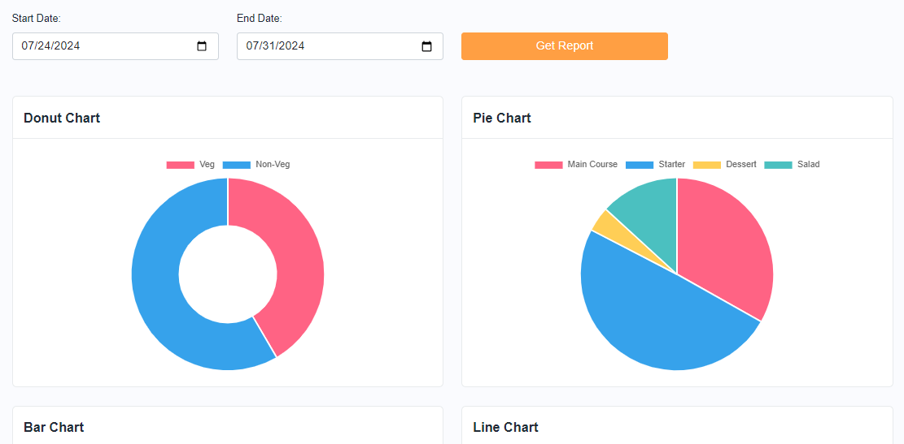

# 🍽️ Restaurant Management System (RMS)

A robust, full-featured **Restaurant Management System (RMS)** built on **Node.js**, **Express**, and **MongoDB**. Designed to streamline day-to-day restaurant operations, from dynamic Point of Sale (POS) and inventory tracking to detailed sales analytics and automated thermal printing.

---

## 🚀 Key Features

*   **🔐 Secure Multi-Tenant Authentication**:
    *   Secure owner/admin registration and login.
    *   Session-based authentication and route guarding using JWT stored in cookies.
*   **📊 Interactive Dashboard**:
    *   Real-time analytical graphs powered by **Chart.js**.
    *   Sales summaries, total orders, and order analytics by date.
*   **🖥️ Point of Sale (POS) Interface**:
    *   Clean, interactive front-end to process orders in real time.
    *   Supports different order types (Dine In, Take Away, Online).
*   **🍽️ Menu & Food Management**:
    *   Add, list, edit, and search for food menu items with pricing details.
*   **📈 Advanced Sales Reporting**:
    *   Track daily, weekly, and custom duration analytics.
    *   Date-range filtering for comprehensive revenue reports.
*   **📦 Inventory & Supplier Tracking**:
    *   Track active ingredient quantities and restock status.
    *   Full CRUD operations to manage Suppliers.
*   **💰 Expense Management**:
    *   Log miscellaneous restaurant expenses (rent, utilities, salaries, etc.) and generate expense lists.
*   **👥 Customer Profiles**:
    *   Track and link customer information with orders.
*   **🖨️ Thermal Printer Integration**:
    *   Automated printing of KOT (Kitchen Order Ticket) and Customer Bills using the `node-thermal-printer` package upon order placement.

---

## 🛠️ Tech Stack

*   **Backend**: Node.js, Express.js
*   **Database**: MongoDB, Mongoose (ODM)
*   **Sessions**: `express-session`, `connect-mongo` (session persistence)
*   **Frontend**: EJS Templates, Bootstrap 4, FontAwesome, JavaScript (ES6+), Chart.js
*   **Security & Auth**: JWT (JSON Web Tokens), HttpOnly cookies, Bcrypt password hashing
*   **Hardware/Receipts**: `node-thermal-printer`

---

## 📁 Project Structure

```text
RMS-restaurant-management-system/
├── app.js               # Application entry point & config
├── db.js                # MongoDB connection utility
├── jwt.js               # JWT sign & verify utility
├── models/              # Mongoose DB Schemas
│   ├── Customer.js
│   ├── Expense.js
│   ├── InventoryItem.js
│   ├── Supplier.js
│   ├── menu.js
│   ├── order.js
│   └── restaurant.js
├── routes/              # Express API and web routes
│   └── restaurantRoutes.js
├── controllers/         # Request handling & business logic
│   ├── dashController.js
│   ├── datereportController.js
│   ├── customerController.js
│   ├── expenseController.js
│   ├── inventoryController.js
│   ├── menuController.js
│   ├── orderController.js
│   ├── reportController.js
│   └── restaurantController.js
├── middleware/          # Route guards / auth middleware
│   └── authMiddleware.js
├── public/              # Static assets (CSS, JS, images, screenshots)
└── views/               # EJS template views (HTML layout)
```

---

## ⚙️ Installation & Setup

### Prerequisites

Ensure you have the following installed on your machine:
*   [Node.js](https://nodejs.org/) (v14 or higher)
*   [MongoDB](https://www.mongodb.com/) (running locally or a MongoDB Atlas URI)

### Setup Steps

1. **Clone the Repository**
   ```bash
   git clone https://github.com/prathvin7/RMS-restaurant-management-system
   cd RMS-restaurant-management-system
   ```

2. **Install Dependencies**
   ```bash
   npm install
   ```

3. **Configure Environment Variables**
   Create a `.env` file in the root of the project and populate it with:
   ```env
   PORT=3000
   MONGODB_URI=mongodb://localhost:27017/RMS
   ```

4. **Start the Application**
   *   **For Development (with Nodemon auto-restart)**:
       ```bash
       npm run dev
       ```
   *   **For Production**:
       ```bash
       npm start
       ```

5. **Access the App**
   Open your browser and navigate to `http://localhost:3000`.

---

## 📖 Main Route Guide

| Route | Method | Description |
| :--- | :--- | :--- |
| `/` | `GET` | Registration/Signup page |
| `/signin` | `GET` | Portal Login/Signin page |
| `/index` | `GET` | Admin Dashboard (Requires Auth) |
| `/pos` | `GET` | Point of Sale billing terminal |
| `/addmenupage` | `GET` | Add new food items |
| `/getmenu` | `GET` | List all menu items |
| `/chart-js` | `GET` | Graphical Sales Report |
| `/datechart` | `GET` | Date-based analytical reports |
| `/addinventory` | `GET` | Add Inventory/Suppliers page |
| `/get-expense-list`| `GET` | Inventory list view |
| `/addexpense` | `GET` | Add a new restaurant expense |
| `/getexpense` | `GET` | View list of logged expenses |

---

## 📸 Screenshots

Here are some previews of the system interface:

### 🔐 User Authentication & Portal Login


### 🖥️ POS Billing Terminal


### 📊 Dashboard & Reports Analytics



---

## 🤝 Contributing

Contributions make the open-source community an amazing place to learn, inspire, and create.
1. Fork the Project.
2. Create your Feature Branch (`git checkout -b feature/AmazingFeature`).
3. Commit your Changes (`git commit -m 'Add some AmazingFeature'`).
4. Push to the Branch (`git push origin feature/AmazingFeature`).
5. Open a Pull Request.

---

## 📄 License

This project is licensed under the MIT License - see the `LICENSE` file for details.